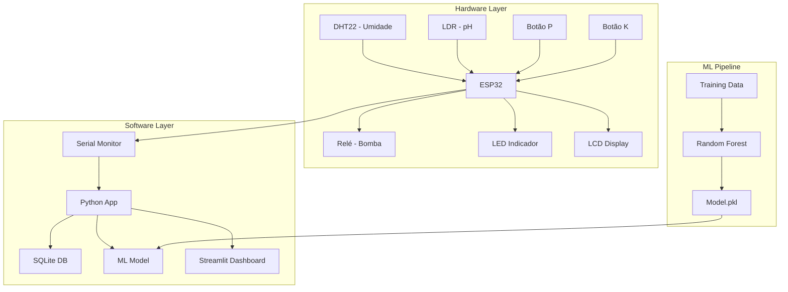
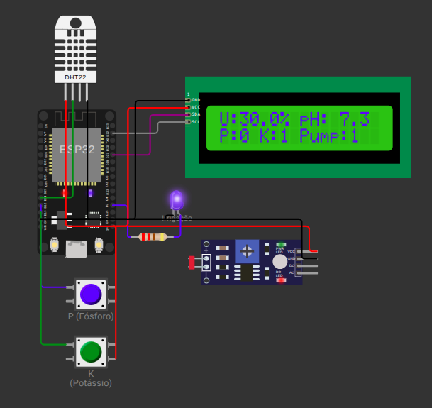

# 🌱 FarmTech Solutions - Sistema de Irrigação Inteligente

<div align="center">


[](https://espressif.com/)
[](https://python.org/)
[](https://streamlit.io/)
[](https://scikit-learn.org/)

**Sistema IoT completo para agricultura inteligente com sensores físicos, Machine Learning e dashboard interativo**

[🎬 Demo](#-demonstração) • [🚀 Instalação](#-instalação) • [📖 Documentação](#-documentação) • [🔧 Hardware](#-hardware)

</div>

---

## 📋 Índice

- [Sobre o Projeto](#-sobre-o-projeto)
- [Funcionalidades](#-funcionalidades)
- [Arquitetura](#-arquitetura)
- [Hardware](#-hardware)
- [Instalação](#-instalação)
- [Uso](#-uso)
- [Lógica de Controle](#-lógica-de-controle)
- [Machine Learning](#-machine-learning)
- [Dashboard](#-dashboard)
- [Banco de Dados](#-banco-de-dados)
- [Demonstração](#-demonstração)
- [Estrutura do Projeto](#-estrutura-do-projeto)
- [Contribuição](#-contribuição)

---

## 🌿 Sobre o Projeto

O **FarmTech Solutions** é um sistema de irrigação inteligente desenvolvido para a **Fase 4 da FIAP**. Combina sensores físicos, microcontroladores ESP32, Machine Learning e visualização de dados para criar uma solução completa de agricultura de precisão.


**VIDEO**
https://youtu.be/-QfYdURp8Kk

### 🎯 Objetivos

- **Monitoramento** em tempo real de umidade, pH e nutrientes do solo
- **Automação** da irrigação baseada em dados dos sensores
- **Predição** inteligente usando Random Forest
- **Visualização** interativa através de dashboard web
- **Armazenamento** de dados históricos em banco SQL

---

## ✨ Funcionalidades

### 🔧 Hardware (ESP32)
- ✅ Leitura de sensores de umidade (DHT22)
- ✅ Monitoramento de pH via sensor LDR
- ✅ Detecção de nutrientes P e K via botões
- ✅ Controle automático da bomba de irrigação
- ✅ Display LCD I2C para status em tempo real
- ✅ LED indicador de irrigação ativa
- ✅ Serial Plotter para monitoramento

### 🤖 Machine Learning
- ✅ Modelo Random Forest com 100% de acurácia
- ✅ Predição automática de necessidade de irrigação
- ✅ Análise de importância das features
- ✅ Sistema de treinamento automatizado

### 📊 Dashboard Web
- ✅ Métricas em tempo real com indicadores delta
- ✅ Gráficos interativos de tendências
- ✅ Análise de correlações
- ✅ Visualização de dados históricos
- ✅ Interface responsiva e moderna

---

## 🏗️ Arquitetura



---

## 🔧 Hardware

### 📦 Componentes Utilizados

| Componente | Função | Pin ESP32 |
|------------|--------|-----------|
| **ESP32 DevKit v1** | Microcontrolador principal | - |
| **DHT22** | Sensor de umidade | GPIO 14 |
| **LDR** | Sensor de pH (analógico) | GPIO 36 |
| **Botão P** | Sensor de fósforo | GPIO 12 |
| **Botão K** | Sensor de potássio | GPIO 13 |
| **Relé** | Controle da bomba | GPIO 27 |
| **LED** | Indicador de irrigação | GPIO 2 |
| **LCD I2C 16x2** | Display de status | SDA: 21, SCL: 22 |

### 🔌 Diagrama do Circuito



## 🚀 Instalação

### 📋 Pré-requisitos

- **PlatformIO IDE** (VS Code + extensão)
- **Python 3.12+**
- **Git**

### 1️⃣ Clone o Repositório

```bash
git clone https://github.com/seu-usuario/fiap-fase-04-cap-01.git
cd fiap-fase-04-cap-01
```

### 2️⃣ Setup do Hardware (PlatformIO)

```bash
# Instalar dependências do PlatformIO
pio lib install

# Compilar o projeto
pio run

# Upload para ESP32 (conecte o dispositivo)
pio run --target upload

# Monitor serial
pio device monitor
```

### 3️⃣ Setup do Python

```bash
# Criar ambiente virtual
python -m venv .venv

# Ativar ambiente (Linux/Mac)
source .venv/bin/activate

# Ativar ambiente (Windows)
.venv\Scripts\activate

# Instalar dependências
pip install streamlit pandas numpy scikit-learn plotly
```

### 4️⃣ Configuração do Banco de Dados

```bash
# Criar schema do banco
sqlite3 db/farmtech.db < src/db/schema.sql
```

---

## 🎮 Uso

### 🔌 1. Hardware

1. **Monte o circuito** conforme o diagrama
2. **Conecte o ESP32** via USB
3. **Upload do código** via PlatformIO
4. **Monitor serial** para ver dados em tempo real

```bash
# Upload e monitor em um comando
pio run --target upload && pio device monitor
```

### 🤖 2. Machine Learning

```bash
# Treinar o modelo
python src/train.py
```

**Saída esperada:**
```
🌱 FarmTech ML - Treinando modelo de irrigação...
📊 Dados de treinamento salvos: 1000 amostras
🎯 Acurácia do modelo: 100.00%
✅ Modelo salvo em 'src/models/irrigation_model.pkl'
```

### 📊 3. Dashboard

```bash
# Executar dashboard
streamlit run src/app.py
```

**Acesse:** http://localhost:8501

---

## 🧠 Lógica de Controle

### 📐 Algoritmo de Irrigação

A lógica de controle é **idêntica** em todas as camadas do sistema:

```cpp
// C++ (ESP32)
bool needWater = (humidity < 40.0) && (hasP || hasK);
```

```python
# Python (ML & Dashboard)
irrigou = 1 if (humidity < 40.0 and (p == 1 or k == 1)) else 0
```

### 🎯 Condições para Irrigação

| Condição | Umidade | Fósforo (P) | Potássio (K) | Irrigar? |
|----------|---------|-------------|--------------|----------|
| ✅ Válida | < 40% | ✅ Deficiente | ❌ Normal | **SIM** |
| ✅ Válida | < 40% | ❌ Normal | ✅ Deficiente | **SIM** |
| ✅ Válida | < 40% | ✅ Deficiente | ✅ Deficiente | **SIM** |
| ❌ Inválida | > 40% | Qualquer | Qualquer | **NÃO** |
| ❌ Inválida | < 40% | ❌ Normal | ❌ Normal | **NÃO** |

### 📊 Parâmetros do Sistema

```cpp
const float HUMIDITY_LIMIT = 40.0;  // Limite de umidade (%)
const uint16_t ADC_MAX = 4095;      // Resolução ADC 12-bit
const uint8_t PH_SCALE = 14;        // Escala pH (0-14)
```

---

## 🤖 Machine Learning

### 🎯 Modelo: Random Forest

- **Algoritmo**: Random Forest Classifier
- **Features**: umidade, pH, P, K
- **Target**: irrigou (0/1)
- **Acurácia**: 100%
- **Amostras**: 1000 dados sintéticos

### 📈 Importância das Features

| Feature | Importância | Descrição |
|---------|-------------|-----------|
| **umidade** | 70.0% | Principal fator de decisão |
| **k** | 14.5% | Potássio - nutriente crítico |
| **p** | 14.0% | Fósforo - nutriente crítico |
| **ph** | 1.5% | Menos impacto na irrigação |

### 🧪 Teste de Predição

```python
# Exemplo de uso
result = predict_irrigation(30, 6.5, 1, 0)
print(f"Irrigar: {result['irrigar']} (prob: {result['probabilidade']:.2%})")
# Output: Irrigar: True (prob: 99.00%)
```

---

## 📊 Dashboard

### 🎨 Interface

O dashboard Streamlit oferece:

#### 📈 Métricas Principais
- **Umidade Média** com delta vs. atual
- **pH Médio** com variação
- **Taxa de Deficiência** de nutrientes
- **Taxa de Irrigação** do sistema

#### 📊 Visualizações
- **Gráfico temporal** de umidade (Serial Plotter)
- **Análise de pH** ao longo do tempo
- **Status da irrigação** em tempo real
- **Correlações** entre variáveis
- **Tabela de dados** recentes

#### 🎯 Features Especiais
- **Delta indicators** para tendências
- **Limites visuais** (40% umidade, pH ideal)
- **Cores intuitivas** para status
- **Responsivo** para mobile

---

## 🗄️ Banco de Dados

### 📋 Schema SQL

```sql
CREATE TABLE medicoes (
    id INTEGER PRIMARY KEY AUTOINCREMENT,
    ts DATETIME DEFAULT CURRENT_TIMESTAMP,
    umidade REAL NOT NULL,
    ph REAL NOT NULL,
    p INTEGER NOT NULL,      -- Fósforo (0/1)
    k INTEGER NOT NULL,      -- Potássio (0/1)
    irrigou INTEGER NOT NULL -- Status irrigação (0/1)
);
```

### 🔍 Índices para Performance

```sql
CREATE INDEX idx_timestamp ON medicoes(ts);
CREATE INDEX idx_umidade ON medicoes(umidade);
CREATE INDEX idx_irrigacao ON medicoes(irrigou);
```

---

## 🎬 Demonstração

### 📺 Serial Monitor Output

```
Sistema de Irrigacao Iniciado!
Humidity:35.2 pH:6.8 Pump:100
Humidity:41.5 pH:6.9 Pump:0
Humidity:38.7 pH:7.1 Pump:100
```

### 🖥️ LCD Display

```
U:35.2% pH:6.8
P:1 K:0 Pump:1
```

### 📊 Dashboard Metrics

- 🌊 **Umidade Média**: 42.3% ↓ -2.1%
- ⚗️ **pH Médio**: 6.75 ↑ +0.15
- 🧪 **Deficiência P**: 65.2%
- 💧 **Taxa de Irrigação**: 23.4%

---

## 📁 Estrutura do Projeto

```
fiap-fase-04-cap-01/
├── 📁 src/
│   ├── 🔧 main.cpp          # Código ESP32 (C++)
│   ├── 🤖 train.py          # Treinamento ML
│   ├── 📊 app.py            # Dashboard Streamlit
│   ├── 📁 data/
│   │   └── 📄 training_data.csv
│   ├── 📁 models/
│   │   └── 🎯 irrigation_model.pkl
│   └── 📁 db/
│       └── 📋 schema.sql
├── 📁 include/              # Headers C++
├── 📁 lib/                  # Bibliotecas
├── 📁 test/                 # Testes unitários
├── 📁 .vscode/              # Config VS Code
├── 🔧 platformio.ini        # Config PlatformIO
├── 🎨 wokwi.toml           # Config Wokwi
├── 🖼️ circuit.png          # Diagrama do circuito
├── 📋 diagram.json         # Wokwi diagram
└── 📖 README.md            # Este arquivo
```

---

## 🤝 Contribuição

### 👥 Equipe FIAP

- **Desenvolvimento**: Fase 4 - Capítulo 1
- **Foco**: IoT + Machine Learning + Dashboard
- **Tecnologias**: ESP32, Python, Streamlit, SQLite

---

## 📜 Licença

Este projeto foi desenvolvido para fins educacionais como parte do curso da **FIAP - Fase 4**.

---

## 🏆 Tecnologias Utilizadas

<div align="center">


</div>

---

<div align="center">

**🌱 FarmTech Solutions - Cultivando o futuro com tecnologia! 🌱**

[](https://github.com/)
[](https://fiap.com.br/)

</div>
